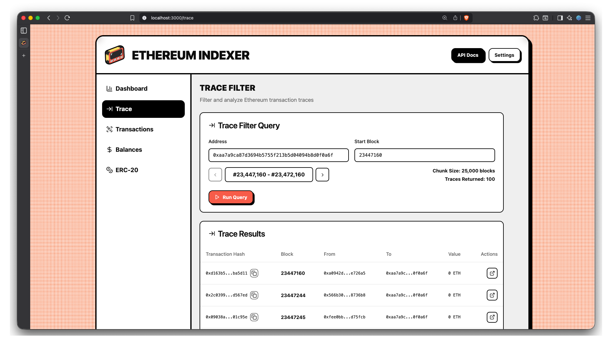

<p align="center">
  
</p>

# Ethereum Indexer

Ethereum blockchain indexer designed to crawl transaction data for specific wallet addresses starting from a given block.

## Quick Start

### Prerequisites

- **Rust** (stable version) - [Install Rust](https://rustup.rs/)
- **Node.js** (>=18) - [Install Node.js](https://nodejs.org/)
- **npm** (comes with Node.js)

### Setup

For a guided setup with automatic environment configuration:

```bash
./scripts/setup.sh
```

This script will:
- Verify all prerequisites are installed
- Let you choose an RPC provider (DRPC, Ithaca, or custom)
- Configure the frontend environment with optimal chunk sizes
- Provide step-by-step instructions to start the application

### RPC Provider Requirements

> [!IMPORTANT]
> Your RPC provider must support the `trace_filter` method for transaction searching to work.

**Performance Notes**:
- Large chunk sizes (50k-100k) may cause timeouts with some providers after some calls
- If you experience timeouts, reduce chunk size in the frontend dashboard and/or change rpc provider
- Free RPC tiers often have rate limits that may affect performance

For more specific queries and examples, see the scripts provided in the `/scripts` directory.

## Structure

The project consists of three main Rust crates and a frontend application:

-   `crates/indexer`: The core library responsible for crawling the blockchain.
-   `crates/indexer-cli`: A command-line interface for interacting with the indexer.
-   `crates/indexer-server`: A web server exposing the indexer's functionality via a REST API.
-   `front`: A web application for displaying the collected data in a human-readable format.

## Documentation

The `/docs` directory contains detailed information about the project:

-   [**`ARCHITECTURE.md`**](./docs/ARCHITECTURE.md): A deep dive into the `indexer` crate's architecture and its core design principles.
-   [**`CLI_GUIDE.md`**](./docs/CLI_GUIDE.md): A comprehensive guide to using the command-line interface.
-   [**`SERVER_API.md`**](./docs/SERVER_API.md): Complete reference for the web server's REST API endpoints.

## Performance

The indexer's high performance is achieved by using the `trace_filter` RPC method, which allows for fetching transaction data in large, parallelized block chunks.

The choice of RPC provider is critical. A fast provider that supports `trace_filter` with large block ranges (e.g., `eth.drpc.org`) is recommended for maximum speed. The current RPC pool implementation uses a round-robin strategy, so using a single fast RPC is more effective than mixing fast and slow ones.

## Basic Usage

To run the web server, set your RPC provider URL and start the application:

```bash
RPC_URLS="https://your-fast-rpc-provider.com/token" \
PARALLEL_PER_RPC=5 \
cargo run --release --package indexer-server
```

To run the web app, navigate to the `/front` directory and run the command:
```bash
npm run start:all
```

