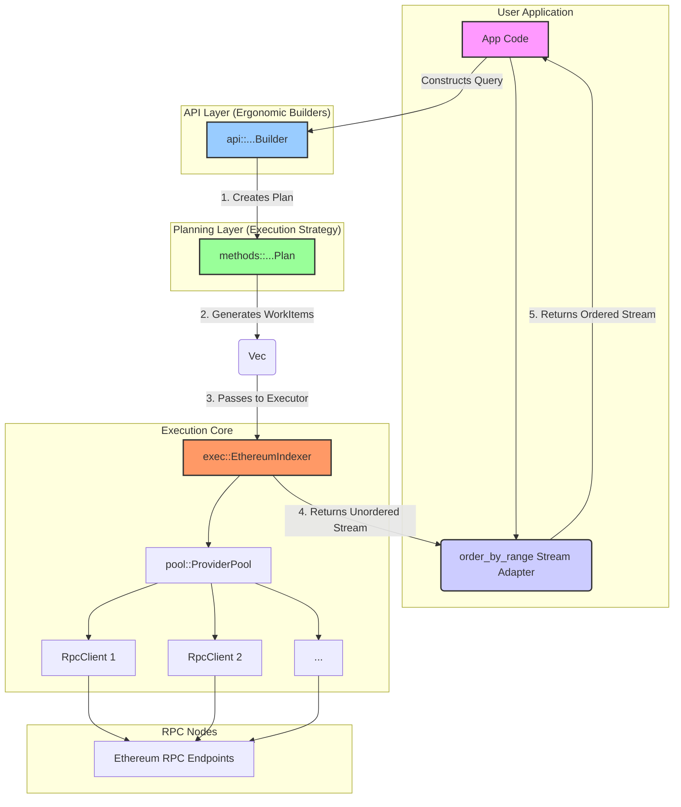

# Indexer Crate Architecture

This document provides a deep dive into the architecture of the `indexer` crate, the core engine of the Ethereum Indexer project. The library is designed for high-performance, parallel data fetching from Ethereum RPC endpoints, with a clean, layered, and ergonomic API.

## Core Design Principles

-   **Parallelism**: Concurrently execute a large number of RPC requests across multiple providers to maximize throughput.
-   **Separation of Concerns**: The process of building a query, planning its execution strategy, and running it are distinct, decoupled steps.
-   **Ergonomics**: A user-friendly Builder pattern on the API layer makes constructing complex queries simple and readable.
-   **Resource Management**: A provider pool handles round-robin load balancing and per-provider request throttling to avoid rate-limiting and overwhelming nodes.

## Architectural Layers

The crate is composed of several distinct layers, each with a specific responsibility. A request flows from the high-level API layer down to the execution core and back up as a stream of results.

### 1. API Layer (`/api`)

This is the primary user-facing layer. It provides a set of **Builders** (e.g., `TraceFilterBuilder`, `GetLogsBuilder`) that use the builder pattern for a fluent and declarative query construction experience.

-   **Responsibility**: Validate user input and assemble query parameters.
-   **Output**: A `methods::...Plan` struct.

### 2. Planning Layer (`/methods`)

This layer defines the execution strategy for a query. Each RPC method has a corresponding **Planner** struct (e.g., `TraceFilterPlan`, `GetLogsPlan`).

-   **Responsibility**: Take a high-level query and break it down into a series of concrete, atomic RPC calls. For queries over large block ranges, the planner uses `order::chunk_range` to split the work into many smaller, manageable chunks.
-   **Output**: A `Vec<WorkItem>`. Each `WorkItem` represents a single JSON-RPC request and is tagged with an `OrderingKey` (typically a block range) so its result can be correctly sequenced later.

### 3. Execution Core (`/exec`, `/pool`)

This is the engine that executes the work.

-   **`EthereumIndexer`**: The central executor. Its `run` method takes a `Vec<WorkItem>` and uses `futures::stream::iter` and `buffer_unordered` to execute them in parallel. It returns a stream of results that arrive in whatever order they are completed.
-   **`ProviderPool`**: Manages the collection of RPC clients. It performs two key functions:
    1.  **Load Balancing**: Distributes requests across providers in a round-robin fashion.
    2.  **Throttling**: Uses a `Semaphore` for each provider to limit the number of concurrent in-flight requests, preventing rate-limiting.
-   **Responsibility**: Efficiently and concurrently execute `WorkItem`s across all available RPC providers.
-   **Output**: A `Stream` of `(OrderingKey, serde_json::Value)` results.

### 4. Stream Ordering (`/order`)

Since the execution core returns results out-of-order, this utility layer provides the `order_by_range` stream adapter.

-   **Responsibility**: Consume the unordered stream from the executor and yield a perfectly ordered stream of results based on the `OrderingKey::Range`. It uses an internal buffer to hold onto chunks that arrive early, waiting to emit them until their sequence is correct.

## Request Lifecycle: A Complete Example

Let's trace a `trace_filter` call from start to finish.

1.  **Construction (API Layer)**: The user creates a `TraceFilterBuilder`, specifies a target address and a large block range (e.g., 1,000,000 blocks), and calls `.plan()`.

2.  **Planning (Methods Layer)**:
    -   The builder creates a `TraceFilterPlan` with the specified parameters.
    -   The plan's `.plan()` method is invoked. It sees the large block range and, using `chunk_range`, divides it into 100 chunks of 10,000 blocks each.
    -   It generates a `Vec<WorkItem>` of 100 items. Each `WorkItem` corresponds to a `trace_filter` call for one chunk and has its `key` set to an `OrderingKey::Range` struct (e.g., `Range { from: 10000, to: 19999 }`).

3.  **Execution (Execution Core)**:
    -   This `Vec<WorkItem>` is passed to `EthereumIndexer::run()`.
    -   The indexer immediately starts dispatching these 100 `WorkItem`s concurrently, limited only by the total parallelism configured across the `ProviderPool`.
    -   The `ProviderPool` deals out requests to its RPC clients one by one in a round-robin sequence, respecting the per-provider concurrency limit.

4.  **Result Streaming**: As the RPC nodes return data, the `run()` method yields results as they complete. The 50th chunk might finish first, followed by the 2nd, then the 73rd, and so on. The stream is unordered.

5.  **Re-ordering (Application)**:
    -   The application wraps the result stream from `run()` in the `order_by_range` stream adapter.
    -   When the result for chunk 2 arrives, `order_by_range` sees that it's not the first chunk and buffers it internally.
    -   When chunk 1 finally arrives, `order_by_range` yields it. It then checks its buffer and sees it now has chunk 2, which it yields immediately. This process continues, ensuring the application receives a perfectly sequenced stream of data, ready for processing.